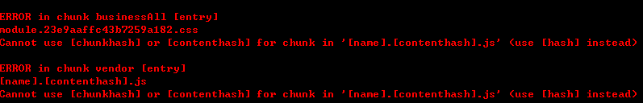
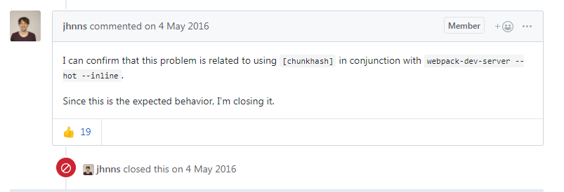

# webpack chunkhash/contenthash和HMR不能共存

###### 问题现象

Webpack-dev-server构建失败，报以下错误：



###### webpack配置代码

```javascript
const hotModuleReplacementPlugin = new webpack.HotModuleReplacementPlugin({});
module.exports={
	output: {
		path: path.resolve(__dirname, "../build"),
		filename: `[name].[contenthash].js`,
		chunkFilename: `[name].[contenthash:6].js`,
		publicPath: "./",
	},
	plugins: [
	miniCssExtractPlugin,
	cleanWebpackPlugin,
	htmlWebpackPlugin,
	copyWebpackPlugin,
	hotModuleReplacementPlugin,
	]
}

```

###### 定位过程

通过谷歌搜索报错信息，发现了一些issue:

https://github.com/webpack/webpack/issues/2393



意思就是，chunkhash和HMR不能共存

下面这个是webpack-dev-server的issue:

https://github.com/webpack/webpack-dev-server/issues/377


###### 问题根因

chunkhash和contenthash和HMR不能共存

###### 复现条件

1. Entry,chunk都设置为chunkhash/contenthash
2. 使用了webpack的热替换功能

###### 解决

办法有两种：

1. 将contenthash/chunkhash改成hash
2. 将HMR去掉：把HotModuleReplacementPlugin去掉，或者dev-server关掉hot:true属性

###### 备注

1. 如果对entry设置hash，对chunk设置chunkhash，则不会引发这个问题

   e.g.

   ```javascript
    output: {
       path: path.resolve(__dirname, "../build"),
       filename: `[name].[hash].js`,
       chunkFilename: `[name].[contenthash:6].js`,
       publicPath: "./",
     },
   ```

2. 在plugin数组中加入

   ```javascript
   new webpack.HotModuleReplacementPlugin()
   ```

   或者在webpack-dev-server配置hot:true 或者 命令行执行 

   ```shell
   webpack-dev-server --hot
   ```

   效果相同.

   详见：

   https://www.webpackjs.com/configuration/dev-server/#devserver-hot

   https://www.webpackjs.com/guides/hot-module-replacement/